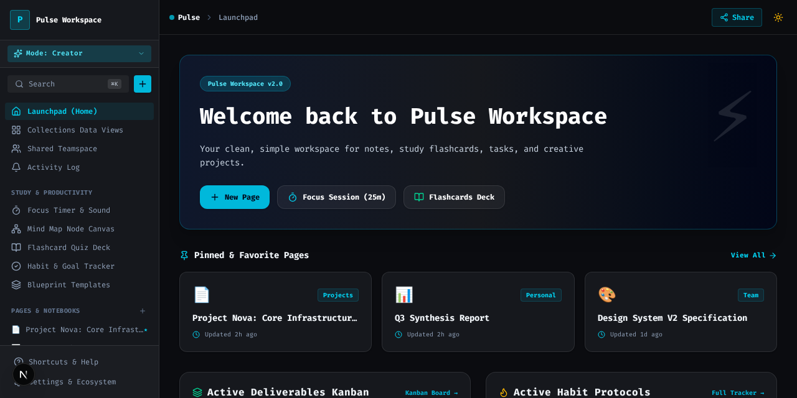
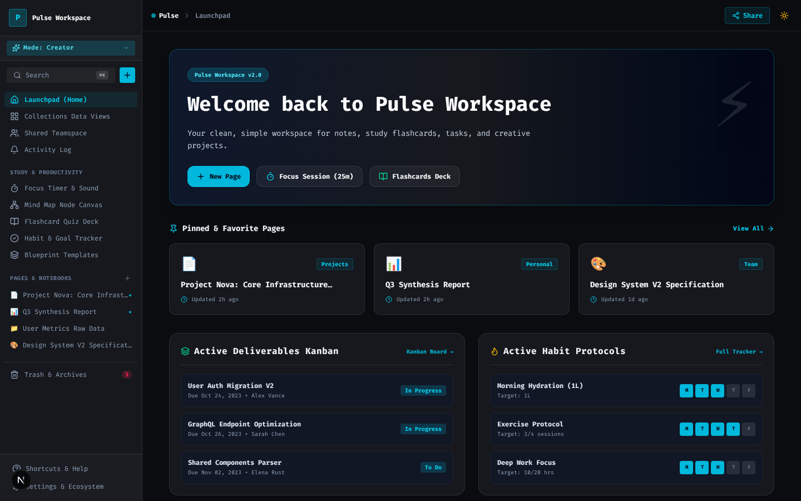
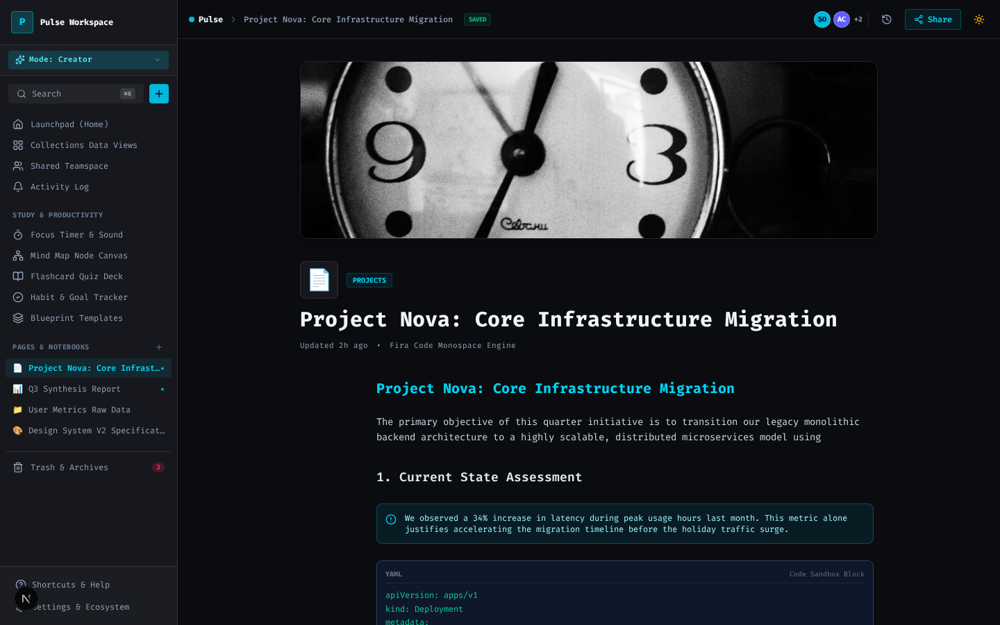
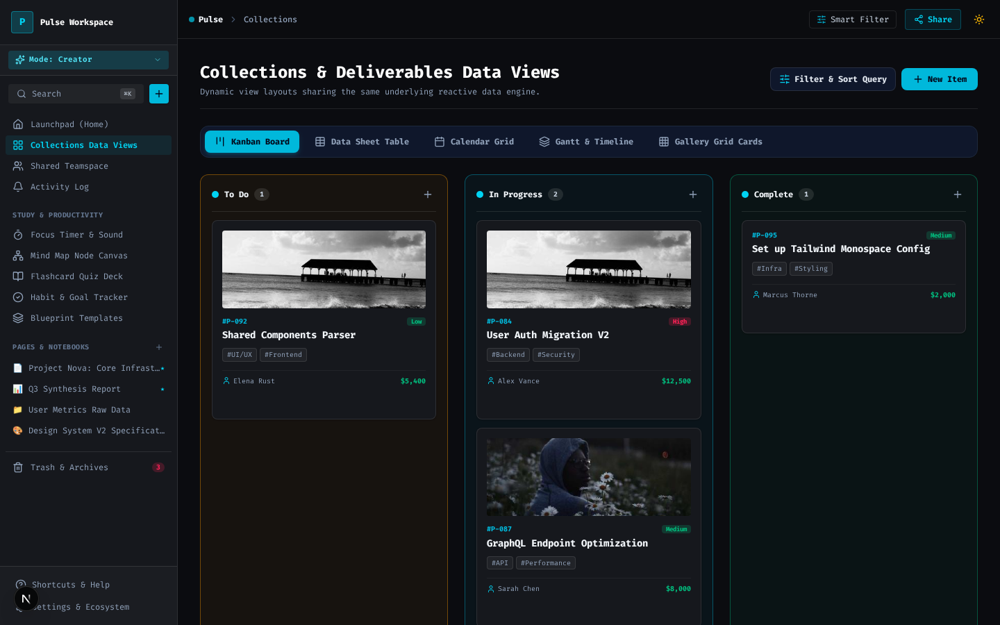
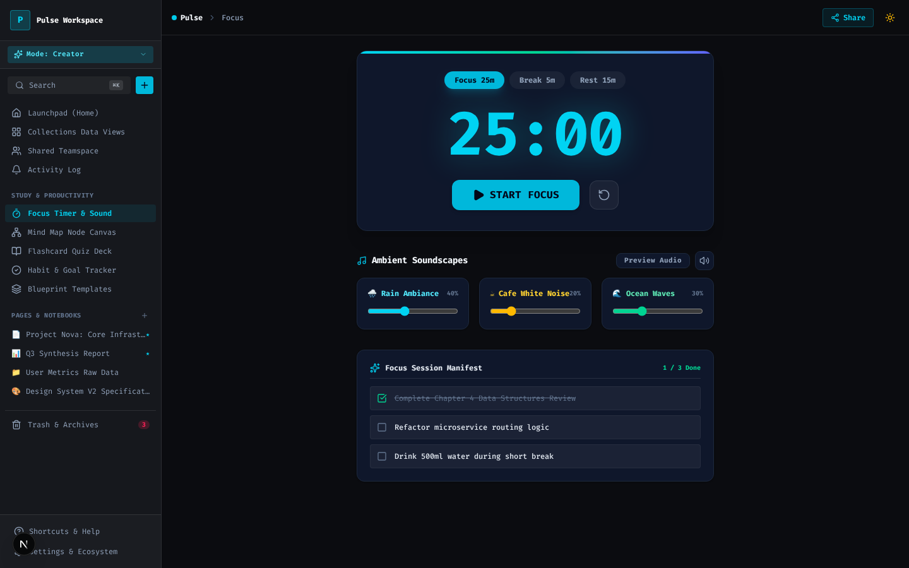

# Pulse Workspace

Block-based workspace for notes, collections, and deep work. A slash-command editor, Kanban / table / calendar / Gantt views, ⌘K spotlight, flashcards, habits, and a focus timer with procedural ambient noise.

[](https://pulse-work-indol.vercel.app)
[](https://github.com/devtechedge/pulse-work/actions/workflows/ci.yml)
[](https://nextjs.org/)
[](https://www.typescriptlang.org/)
[](https://tailwindcss.com/)
[](LICENSE)

---

## Live Demo

**https://pulse-work-indol.vercel.app**

> **Status:** Portfolio demo. Notebooks, collections, habits, and the timer live in **React client memory** and reset on refresh. There is no auth backend. Billing screens are simulated (`alert()`). No Gemini key is required.

This is the **only** public repo for Pulse Workspace.

---

## Screenshots

<p align="center">
  
</p>

| Launchpad | Editor |
|-----------|--------|
|  |  |

| Collections | Focus timer |
|-------------|-------------|
|  |  |

---

## Features

- Launchpad with pinned pages, deliverables, and habit chips
- Block editor with slash commands, covers, and version-history chrome
- Collections that share one dataset across Kanban, table, calendar, Gantt, and gallery
- ⌘K spotlight search over notebook titles
- Focus timer (25 / 5 / 15) with Web Audio white / pink / brown noise
- Flashcards, habit week grid, mind map, templates, trash
- Light / dark Fira Code shell

---

## Tech Stack

| Layer | Technology |
|-------|------------|
| App | Next.js 15 (App Router), React 19, TypeScript |
| UI | Tailwind 4, Lucide, Fira Code |
| Data | In-memory React context (`context/WorkspaceContext.tsx`) |
| Audio | Web Audio API (procedural noise, no samples) |
| Hosting | Vercel |
| CI | GitHub Actions — Vitest, `tsc`, Playwright |

---

## Quick Start

```bash
git clone https://github.com/devtechedge/pulse-work.git
cd pulse-work
npm install
npm run dev
```

Open **http://localhost:3000**. No environment variables required.

```bash
npm test
npm run typecheck
npx playwright install chromium
npm run test:e2e
```

---

## Security

Portfolio demo: no auth, in-memory client store, simulated billing. Details: **[SECURITY.md](SECURITY.md)**.

---

## License

MIT. See [LICENSE](LICENSE).
